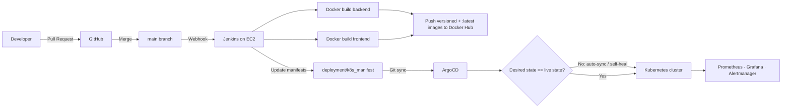

<div align="center">

# 🌍 Wanderlust — Project Documentation

**A production-grade, cloud-native travel blog platform demonstrating end-to-end DevOps:
Infrastructure as Code, Configuration Management, Containerization, CI/CD, and GitOps on AWS.**

[](https://kubernetes.io/)
[](https://aws.amazon.com/)
[](https://www.terraform.io/)
[](https://www.ansible.com/)
[](https://argo-cd.readthedocs.io/)
[](https://www.jenkins.io/)
[](https://www.docker.com/)
[](https://www.typescriptlang.org/)
[](https://react.dev/)
[](https://nodejs.org/)
[](https://www.mongodb.com/)
[](https://redis.io/)

</div>

---

## 📑 Table of Contents

1. [Executive Summary](#-executive-summary)
2. [Key Achievements & Skills Demonstrated](#-key-achievements--skills-demonstrated)
3. [System Architecture](#-system-architecture)
4. [Technology Stack](#-technology-stack)
5. [Repository Structure](#-repository-structure)
6. [Application Layer](#-application-layer)
   - [Frontend](#frontend)
   - [Backend & REST API](#backend--rest-api)
   - [Data Layer (MongoDB + Redis)](#data-layer-mongodb--redis)
7. [Getting Started (Local Development)](#-getting-started-local-development)
8. [Environment Variables & Secrets](#-environment-variables--secrets)
9. [Testing & Code Quality](#-testing--code-quality)
10. [Containerization (Docker)](#-containerization-docker)
11. [Infrastructure as Code (Terraform)](#-infrastructure-as-code-terraform)
12. [Configuration Management (Ansible)](#-configuration-management-ansible)
13. [Kubernetes Platform](#-kubernetes-platform)
14. [CI/CD Pipeline (Jenkins)](#-cicd-pipeline-jenkins)
15. [GitOps Delivery (ArgoCD)](#-gitops-delivery-argocd)
16. [Observability (Prometheus · Grafana · Alertmanager)](#-observability-prometheus--grafana--alertmanager)
17. [Security Practices](#-security-practices)
18. [Design Decisions & Trade-offs](#-design-decisions--trade-offs)
19. [Interview Talking Points](#-interview-talking-points)
20. [Live Endpoints](#-live-endpoints)
21. [Roadmap / Future Improvements](#-roadmap--future-improvements)
22. [License & Author](#-license--author)

---

## 🎯 Executive Summary

**Wanderlust** is a full-stack blogging platform for travel enthusiasts — users sign up (email/password or Google OAuth), write and categorize travel posts, browse featured/latest content, and administrators moderate posts and manage user roles through a dedicated dashboard.

What elevates it beyond a typical CRUD app is the **delivery platform around it**:

- The entire cloud footprint (VPC, subnets, security groups, EC2, SSH keys, DNS records) is codified in **Terraform**, with remote encrypted state in S3.
- A **zero-touch bootstrap chain** — Terraform provisions the servers, waits for SSH, then triggers **Ansible** playbooks that install tooling, stand up a Kubernetes cluster, and deploy ArgoCD plus a full monitoring stack — with no manual steps.
- **Jenkins** builds and publishes versioned Docker images on every change; **ArgoCD** continuously reconciles the cluster with the manifests in Git (GitOps).
- The application itself is fully **TypeScript**, production-hardened: JWT cookie-based auth with RBAC, Redis response caching, input validation, structured error handling, and automated unit + integration tests.

---

## 🏆 Key Achievements & Skills Demonstrated

| Area | What was built |
|---|---|
| **Infrastructure as Code** | Multi-file Terraform project (network, compute, DNS, outputs) with S3 remote state, generated SSH keys, and automatic Cloudflare DNS record creation. |
| **Configuration Management** | Idempotent Ansible playbooks for tool installation, cluster creation, ingress controller, ArgoCD, and the kube-prometheus stack. |
| **Immutable CI** | Jenkins declarative pipelines producing immutable, build-number-tagged Docker images pushed to Docker Hub. |
| **GitOps CD** | ArgoCD watches the Kubernetes manifests in Git and self-heals the live cluster to match — Git is the single source of truth. |
| **Observability** | Prometheus metrics, Grafana dashboards, and Alertmanager — each with its own DNS-secured ingress. |
| **Backend Engineering** | TypeScript/Express API with JWT auth, Google OAuth 2.0 (Passport.js), role-based access control (User/Admin), and Redis-cached read paths. |
| **Frontend Engineering** | React 18 + Vite SPA with Tailwind + shadcn/ui, typed forms via react-hook-form + zod, route guards, and an admin console. |
| **Quality Gates** | Jest/Vitest suites, Husky pre-commit hooks, lint-staged, ESLint + Prettier, PR title/template enforcing GitHub Actions. |

---

## 🏗️ System Architecture

### High-Level Request Flow

```text
                        [ Internet Users ]
                               │
                             HTTPS
                               ▼
                  ┌────[ Cloudflare DNS ]────┐        (A records created by Terraform)
                  │     Edge proxy / CDN     │
                  └─────────────┬────────────┘
                                ▼
                 [ AWS VPC 10.0.0.0/16 — Public Subnet ]
                                │
              ┌─────────────────┴─────────────────┐
              ▼                                    ▼
   ┌───────────────────────┐          ┌──────────────────────────────┐
   │  EC2: jenkins-server  │          │   EC2: deployment-server     │
   │  • Jenkins (CI)       │  push    │   • Kubernetes cluster       │
   │  • Docker builds      ├─────────▶│   • NGINX Ingress Controller │
   │  • Push to Docker Hub │  images  │   • ArgoCD (GitOps)          │
   └───────────────────────┘          │   • Prometheus/Grafana       │
                                      └──────────────┬───────────────┘
                                                     ▼
                              ┌────────────[ Ingress ]────────────┐
                              ▼                                   ▼
                    ┌───────────────────┐            ┌───────────────────────┐
                    │ Frontend (Nginx   │   /api/*   │ Backend API           │
                    │ serving React SPA)│───────────▶│ Node.js + Express TS  │
                    └───────────────────┘            └──────┬──────────┬─────┘
                                                            ▼          ▼
                                                  ┌──────────────┐  ┌────────┐
                                                  │  MongoDB     │  │ Redis  │
                                                  │ (StatefulSet)│  │ cache  │
                                                  └──────────────┘  └────────┘
```

### GitOps Delivery Model (mermaid — rendered on GitHub)



### Design Principles

- **Git as the single source of truth** — application code *and* environment state live in version control; manual `kubectl` changes are drift that ArgoCD corrects.
- **Immutable artifacts** — every image is tagged `0.0.<BUILD_NUMBER>`; rollbacks are a matter of redeploying a previous tag.
- **Separation of concerns** — CI (Jenkins) only *builds and publishes*; CD (ArgoCD) only *deploys and reconciles*. The CI server holds no long-lived cluster credentials.
- **Everything reproducible** — a fresh AWS account can be taken from nothing to a running, monitored platform with `terraform apply` alone.

---

## 🛠️ Technology Stack

### Application

| Layer | Technologies |
|---|---|
| Frontend | React 18, Vite, TypeScript, Tailwind CSS, shadcn/ui (Radix + CVA), react-hook-form, zod, react-router-dom, react-toastify, Axios, tsParticles |
| Backend | Node.js 21, Express 4, TypeScript (ESM), Mongoose (MongoDB), Passport.js + passport-google-oauth20, JSON Web Tokens, express-session, bcryptjs, compression, cookie-parser, CORS |
| Data | MongoDB 7.0 (persistent StatefulSet), Redis 7 (read-through response cache) |
| Testing | Jest + ts-jest + Supertest (backend), Vitest + Testing Library (frontend) |

### Platform / DevOps

| Concern | Technologies |
|---|---|
| Cloud provider | Amazon Web Services (EC2, VPC, S3 remote state) |
| IaC | Terraform (aws 6.47, cloudflare 5.17, tls, local providers) |
| Configuration | Ansible (playbooks + generated inventory, over SSH) |
| Containers | Docker (multi-stage builds), Docker Hub registry |
| Orchestration | Kubernetes (kind cluster on EC2; manifests are plain K8s — portable to EKS/GKE) |
| CI | Jenkins (declarative pipelines per service) |
| CD / GitOps | ArgoCD |
| Ingress / edge | NGINX Ingress Controller, Cloudflare DNS + proxy |
| Monitoring | kube-prometheus-stack (Prometheus, Grafana, Alertmanager) |
| DevX | Docker Compose, Husky, lint-staged, ESLint, Prettier |

---

## 📁 Repository Structure

```text
wanderlust/
├── PROJECT_DOCUMENTATION.md      ← this document
├── README.md                     ← quick-start overview
├── docker-compose.yml            ← one-command local stack (Mongo+Redis+API+SPA)
├── package.json                  ← root scripts: install/dev both apps concurrently
│
├── frontend/                     ← React SPA
│   ├── Dockerfile                ← multi-stage: Vite build → Nginx
│   ├── Jenkinsfile               ← frontend CI pipeline
│   ├── nginx.conf                ← SPA routing + static serving
│   ├── src/
│   │   ├── pages/                ← home, details, add/edit blog, sign in/up,
│   │   │                         admin-blogs, admin-users, not-found
│   │   ├── components/           ← blog feed, post cards, hero, modals,
│   │   │                         skeletons, admin sidebar, route guards
│   │   ├── layouts/ hooks/ lib/  ← shared layout, custom hooks, utilities
│   │   └── __tests__/            ← Vitest + Testing Library specs
│   └── vercel.json               ← optional Vercel deployment config
│
├── backend/                      ← REST API
│   ├── Dockerfile                ← multi-stage: tsc build → slim production
│   ├── Jenkinsfile               ← backend CI pipeline
│   ├── api/                      ← serverless entry (Vercel-compatible)
│   ├── app.ts / server.ts        ← Express wiring / bootstrap (DB+Redis first)
│   ├── config/                   ← db.ts, passport.ts (Google SSO), env utils
│   ├── routes/                   ← auth.ts, posts.ts, user.ts
│   ├── controllers/              ← auth, posts, user handlers
│   ├── middlewares/              ← auth (JWT), RBAC admin, post-author checks, errors
│   ├── models/                   ← user.ts (roles), post.ts (Mongoose schemas)
│   ├── services/redis.ts         ← Redis client + lifecycle
│   ├── utils/                    ← api-error/response, async-handler, cache keys
│   ├── data/                     ← seed script + sample_posts.json
│   └── tests/                    ← unit + integration (Jest, Supertest)
│
├── terraform/                    ← full AWS + Cloudflare infrastructure
│   ├── provider.tf               ← providers + encrypted S3 backend
│   ├── network.tf                ← VPC, IGW, public/private subnets, route tables
│   ├── compute.tf                ← EC2 instances, security groups, SSH keypair,
│   │                               SSH-wait + Ansible trigger provisioners
│   ├── cloudflare.tf             ← DNS A-records for all public subdomains
│   ├── output.tf                 ← server IPs + generated Ansible inventory
│   └── install_jenkins_docker.sh ← Jenkins server bootstrap (user_data)
│
├── deployment/
│   ├── ansible/
│   │   ├── inventory/            ← auto-generated by Terraform
│   │   └── playbook/             ← setup_tools, setup_kubernetes (kind),
│   │                             setup_ingress_controller, mongodb_init_cm,
│   │                             setup_argocd, setup_kube_prometheus_stack
│   └── k8s_manifest/             ← ArgoCD-synced desired state
│       ├── backend/  frontend/   ← Deployments, Services, Ingress
│       ├── mongodb/  redis/      ← data tier resources
│       └── configs/              ← ConfigMap, secret.example, argocd/nginx ingress
│
└── .github/                      ← PR/issue templates, title checker,
                                    workflow automation, contribution guides
```

---

## 🧩 Application Layer

### Frontend

A responsive single-page application built for a pleasant reading and authoring experience:

- **Blog feed & discovery** — featured posts, latest posts, category pills and filtering, related-posts, and skeleton loading states for perceived performance.
- **Authoring** — rich post creation/editing form (title, description, image, categories/tags) validated with **zod schemas** through **react-hook-form**.
- **Authentication** — email/password sign-in/up and Google OAuth; protected routes via `require-auth` / `unprotected-route` guards.
- **Admin console** — sidebar-driven dashboard (`admin-container`, `admin-sidebar`) for reviewing all blogs (`admin-blogs`) and managing users & roles (`admin-users`).
- **Polish** — dark/light **theme toggle**, animated particles hero, toast notifications, and a mobile-optimized post view.

### Backend & REST API

Express + TypeScript API mounted under `/api` with cookie-based JWT sessions and configurable CORS (credentials enabled).

#### Auth — `/api/auth`

| Method | Endpoint | Access | Description |
|---|---|---|---|
| `POST` | `/email-password/signup` | Public | Register with email/username + password (bcrypt-hashed) |
| `POST` | `/email-password/signin` | Public | Sign in with email **or** username + password |
| `GET`  | `/google` | Public | Start Google OAuth 2.0 flow (Passport) |
| `GET`  | `/google/callback` | Public | OAuth callback → issues JWT in `httpOnly` cookie, redirects to SPA |
| `GET`  | `/check` | Authenticated | Return current token + user id/role |
| `GET`  | `/check/:_id` | Public | Check whether a user is logged in |
| `POST` | `/signout` | Authenticated | Invalidate the session cookie |

#### Posts — `/api/posts`

| Method | Endpoint | Access | Description |
|---|---|---|---|
| `GET`  | `/` | Public (cached) | List all posts — served from Redis when warm |
| `GET`  | `/featured` | Public (cached) | Featured posts |
| `GET`  | `/latest` | Public (cached) | Latest posts |
| `GET`  | `/categories/:category` | Public | Posts filtered by category |
| `GET`  | `/related-posts-by-category` | Public | Related posts for recommendations |
| `GET`  | `/:id` | Public | Single post by id |
| `POST` | `/` | Authenticated | Create a post |
| `PATCH`| `/:id` | Author only | Update own post (`isAuthorMiddleware`) |
| `DELETE`| `/:id` | Author only | Delete own post |
| `PATCH`| `/admin/:id` | Admin only | Moderate/update any post |
| `DELETE`| `/admin/:id` | Admin only | Delete any post |

#### Users — `/api/user` (Admin-only)

| Method | Endpoint | Description |
|---|---|---|
| `GET` | `/` | List all users |
| `PATCH` | `/:userId` | Promote/demote a user's role |
| `DELETE` | `/:userId` | Delete a user |

Key API mechanics:

- **RBAC** — `authMiddleware` verifies the JWT cookie; `isAdminMiddleware` and `isAuthorMiddleware` layer role/ownership checks.
- **Consistent responses** — `ApiResponse` / `ApiError` wrappers and a centralized `errorMiddleware` keep error shapes uniform.
- **Read-through cache** — `cacheHandler` middleware short-circuits hot read endpoints via Redis keys (`REDIS_KEYS.ALL_POSTS`, `FEATURED_POSTS`, `LATEST_POSTS`, …).

### Data Layer (MongoDB + Redis)

- **MongoDB 7.0** persists `users` (username/email, hashed password, `role: user | admin`) and `posts` (author ref, title, description, image, categories, featured flag, timestamps). Seed script + `sample_posts.json` bootstrap realistic content in local/dev environments.
- **Redis 7** caches serialized responses of the hottest read endpoints, cutting MongoDB load and response latency on the blog feed.
- **Graceful startup** — the server only accepts traffic after both MongoDB and Redis connections succeed; on failure the process exits non-zero so the orchestrator restarts it.

---

## 🚀 Getting Started (Local Development)

### Prerequisites

- Node.js ≥ 18 and npm
- Docker + Docker Compose (for the containerized path)
- MongoDB 7 and Redis 7 running locally **or** via Compose (bare-metal path)

### Option A — Docker Compose (recommended, one command)

```bash
git clone https://github.com/Spygram/wanderlust.git
cd wanderlust

# backend/.env.docker holds local env vars (see Environment Variables section)
docker compose up --build
```

| Service | URL |
|---|---|
| Frontend (Nginx) | http://localhost:80 |
| Backend API | http://localhost:5000 |
| MongoDB | internal `mongodb:27017` (seeded with sample posts) |
| Redis | internal `redis:6379` |

### Option B — Bare metal (npm workspaces-style scripts)

```bash
# 1. Install root, backend and frontend dependencies
npm run installer

# 2. Configure environment
cp backend/.env.sample backend/.env      # fill in values
cp frontend/.env.sample frontend/.env

# 3. Ensure MongoDB & Redis are reachable, then start both apps
npm start        # runs FRONTEND (vite, :5173) + BACKEND (tsx watch, :8080) concurrently
```

Useful root scripts:

| Script | Purpose |
|---|---|
| `npm run installer` | Install dependencies for root + backend + frontend |
| `npm start` | Run both apps concurrently with labeled, colored output |
| `npm run start-backend` / `start-frontend` | Run a single app |

---

## 🔐 Environment Variables & Secrets

### Backend (`backend/.env`)

| Variable | Example | Purpose |
|---|---|---|
| `PORT` | `8080` | API listen port (container exposes 5000) |
| `MONGODB_URI` | `mongodb://127.0.0.1/wanderlust` | Mongo connection string |
| `MONGODB_DB_NAME` / `MONGODB_USER` / `MONGODB_PASSWORD` | — | Split credentials form (used by k8s ConfigMap/Secret) |
| `REDIS_URL` | `redis://127.0.0.1:6379` | Cache connection |
| `JWT_SECRET` | (long random hex) | Token signing key |
| `ACCESS_TOKEN_EXPIRES_IN` / `ACCESS_COOKIE_MAXAGE` | `120s` / `120000` | Access-token TTL |
| `REFRESH_TOKEN_EXPIRES_IN` / `REFRESH_COOKIE_MAXAGE` | `120s` / `120000` | Refresh-token TTL |
| `SESSION_SECRET` | — | express-session secret |
| `FRONTEND_URL` / `BACKEND_URL` | `http://localhost:5173` | CORS allow-list / OAuth redirects |
| `GOOGLE_CLIENT_ID` / `GOOGLE_CLIENT_SECRET` | — | Google OAuth credentials |
| `NODE_ENV` | `development` | Toggles secure cookie flag etc. |

### Frontend (`frontend/.env`)

| Variable | Example | Purpose |
|---|---|---|
| `VITE_API_PATH` | `http://localhost:8080` | Base URL for API calls (baked in at build time) |

### Secret handling in production

- Non-sensitive config → Kubernetes **ConfigMap** (`deployment/k8s_manifest/configs/configmap.yaml`).
- Credentials → Kubernetes **Secrets** (`secret.example.yaml` is the committed template; the real Secret is injected via the `configmap_secrets.yaml` Ansible playbook and never committed).
- Jenkins credentials (Docker Hub) stored in the Jenkins credential store and injected with `withCredentials`.

---

## ✅ Testing & Code Quality

| Layer | Tooling | Coverage |
|---|---|---|
| Backend | Jest + ts-jest + Supertest | `tests/unit` (controllers, utils) and `tests/integration` (HTTP-level API behavior) with a global teardown for clean DB/Redis shutdown |
| Frontend | Vitest + Testing Library | Component/user-interaction specs in `src/__tests__`; `npm run coverage` for v8 reports |
| Pre-commit | Husky + lint-staged | `prettier --write` + `eslint --fix` run automatically on staged files |
| PR hygiene | GitHub Actions | Semantic **PR-title checker**, PR-template validation, and automatic issue-assignment workflows keep history and process consistent |

```bash
cd backend  && npm test          # unit + integration, with coverage
cd frontend && npm test           # vitest run
```

---

## 🐳 Containerization (Docker)

Both apps use **multi-stage Dockerfiles** for small, hardened images:

- **Backend** — `node:21-alpine` build stage compiles TS → `dist/`; production stage installs only runtime deps (`npm ci --omit=dev`), runs as the non-root `node` user, and starts with `node dist/server.js` (port 5000).
- **Frontend** — build stage runs the Vite production build with the API URL injected as a **build-arg** (`VITE_API_PATH`); the static bundle is served by **`nginx:alpine`** with a custom config for SPA fallback routing.

Published artifacts (per build):

```text
spygram/wanderlust_backend:0.0.<BUILD_NUMBER>   (+ :latest)
spygram/wanderlust_frontend:0.0.<BUILD_NUMBER>  (+ :latest)
```

---

## 🌐 Infrastructure as Code (Terraform)

The `terraform/` directory provisions the complete platform foundation in **us-east-1** with an **encrypted S3 remote backend** (`3-tier-project-statefile`).

### Networking (`network.tf`)

- VPC `wanderlust-vpc` — `10.0.0.0/16` with DNS support/hostnames enabled.
- Internet Gateway + public route table → **public subnet** `10.0.1.0/24` (auto-assign public IP).
- **Private subnets** `10.0.10.0/24`, `10.0.11.0/24` across AZs (isolated; ready for a future RDS/data tier).

### Compute & Access (`compute.tf`)

| Resource | Detail |
|---|---|
| `wanderlust-jenkins-server` | `t3.medium`, 40 GB gp3; bootstrapped via `user_data` with Jenkins + Docker |
| `deployment-server` | `t3.medium`, 32 GB gp3; hosts the Kubernetes workload cluster |
| SSH keypair | **Generated in-code** (ED25519 via the `tls` provider); private key written locally with `0600` permissions |
| Security groups | Jenkins SG (22, 8080), deployment SG (22, 80, 5000); least-privilege evolution path noted inline |

### Automated bootstrap chain

1. `terraform_data.wait_for_ssh` — polls the deployment server over SSH until reachable (no race conditions on fresh instances).
2. `terraform_data.run_ansible` — executes the full Ansible suite **in order** (tools → cluster → ingress → Mongo init → ArgoCD → monitoring).
3. `output.tf` — prints server IPs and **auto-generates the Ansible inventory** from live resource attributes.

### DNS automation (`cloudflare.tf`)

Terraform creates proxied Cloudflare **A-records** pointing at the deployment server for every public subdomain — no manual DNS edits: `frontend.`, `backend.`, `argocd.`, `prometheus.`, `grafana.`, `alertmanager.`

```bash
cd terraform
terraform init
terraform plan  -var="cloudflare_api_token=..." -var="cloudflare_zone_id=..."
terraform apply -var="cloudflare_api_token=..." -var="cloudflare_zone_id=..."
```

---

## ⚙️ Configuration Management (Ansible)

Playbooks in `deployment/ansible/playbook/` run against the Terraform-generated inventory and converge the deployment server into a ready platform:

| Playbook | Responsibility |
|---|---|
| `setup_tools.yaml` | Install base tooling (Docker, kubectl, kind, Helm, …) |
| `setup_kubernetes.yaml` | Create the **kind** Kubernetes cluster from `kind-config.yaml` (idempotent — skips if the cluster exists) |
| `setup_ingress_controller.yaml` | Install/verify the NGINX Ingress Controller |
| `mongodb_init_cm.yaml` | Apply MongoDB initialization ConfigMap (seed content) |
| `setup_argocd.yaml` | Create the `argocd` namespace and install ArgoCD (server-side apply) |
| `setup_kube_prometheus_stack.yaml` | Deploy Prometheus + Grafana + Alertmanager via Helm |
| `configmap_secrets.yaml` | Materialize the non-committed Kubernetes Secret/Config values |

---

## ☸️ Kubernetes Platform

Desired state lives in `deployment/k8s_manifest/` and is synced by ArgoCD:

| Component | Manifest | Notes |
|---|---|---|
| Backend | `backend/backend.yaml` | Deployment + ClusterIP Service (5000) + host-based Ingress; env injected from `backend-config` ConfigMap + `backend-secret` Secret |
| Frontend | `frontend/frontend.yaml` | Deployment + Service + Ingress serving the Nginx SPA |
| MongoDB | `mongodb/mongodb.yaml` | Stateful workload with persistent storage |
| Redis | `redis/redis.yaml` | Cache tier backing the read-through middleware |
| Shared config | `configs/` | `configmap.yaml`, `secret.example.yaml`, `nginx-ingress.yaml`, `argocd-ingress.yaml` |
| Monitoring | `monitoring/monitoring-ingress.yaml` | Ingress routes for Prometheus/Grafana/Alertmanager |

Ingress is **host-based**: the same NGINX controller routes `frontend.*`, `backend.*`, `argocd.*`, and the monitoring subdomains to the right Services.

---

## 🔄 CI/CD Pipeline (Jenkins)

Each service ships a declarative `Jenkinsfile`; both follow the same contract:

1. **Login to Docker Hub** — via the `dockerhub_credential` Jenkins credential (password over stdin; never echoed).
2. **Docker build & push** — multi-stage build, tagged with the immutable `0.0.${BUILD_NUMBER}` and `:latest`; the frontend build injects the production API URL as a build-arg.
3. **Post actions** — explicit success/failure notifications in the build log.

The frontend/backend manifests in Git reference the pushed images; once the desired image tag is updated, ArgoCD takes over (below). Result: **commit → image → cluster** without anyone SSH-ing into a server.

---

## 🚢 GitOps Delivery (ArgoCD)

- ArgoCD (installed by Ansible into the `argocd` namespace) continuously **watches `deployment/k8s_manifest/`**.
- Any difference between Git and the live cluster is surfaced as **OutOfSync** and converged automatically (auto-sync + self-heal).
- **Rollback = `git revert`** — reverting a manifest change to a previous image tag rolls the cluster back with the same audited workflow used to roll forward.
- Jenkins needs **no cluster credentials** — a clean security boundary between CI and CD.

---

## 📊 Observability (Prometheus · Grafana · Alertmanager)

Deployed via the community `kube-prometheus-stack` Helm chart by Ansible, then exposed through dedicated ingresses with Cloudflare DNS:

- **Prometheus** — cluster/node/pod metrics scraping and time-series storage.
- **Grafana** — pre-provisioned Kubernetes dashboards (cluster health, pod resources, node pressure).
- **Alertmanager** — alert routing for critical conditions (pod crash loops, resource saturation).

Access points (see [Live Endpoints](#-live-endpoints)) are proxied through Cloudflare by the Terraform-managed DNS records.

---

## 🛡️ Security Practices

- **Passwords** bcrypt-hashed; sessions carried in **`httpOnly` cookies** (Secure in production, SameSite=Lax) — XSS-exfiltration resistant.
- **RBAC everywhere** — admin and author-only middleware enforced server-side, never just hidden in the UI.
- **Secret isolation** — credentials live in Kubernetes Secrets / Jenkins credentials; only `secret.example.yaml` templates are committed.
- **Non-root containers** and minimal runtime images (`alpine`, `--omit=dev`).
- **Edge protection** — Cloudflare proxy hides origin IPs and terminates TLS.
- **Encrypted Terraform state** in S3; SSH private key generated per-deployment with `0600` perms, never committed.
- **CI/CD separation** — deploy credentials exist only inside the cluster (ArgoCD), not on the CI server.

---

## ⚖️ Design Decisions & Trade-offs

| Decision | Rationale | Trade-off accepted |
|---|---|---|
| **kind cluster on EC2** for the workload | Zero managed-control-plane cost while keeping 100% standard Kubernetes manifests — the same YAML deploys to EKS/GKE untouched | Self-managed node lifecycle; EKS upgrade path documented for scale-out |
| **ArgoCD GitOps over `kubectl apply` in CI** | Auditable desired state, drift detection, self-healing, trivial rollbacks | Extra component to operate |
| **Two pipelines: Jenkins (CI) + ArgoCD (CD)** | Clean trust boundary; CI never holds cluster credentials | Two systems to learn/maintain |
| **Redis read-through cache on feed endpoints** | Feed/featured/latest are read-heavy and write-light — perfect cache candidates; TTL-based invalidation via write-path clearing | Eventual consistency window on cached feeds |
| **JWT in httpOnly cookie (vs. header)** | Mitigates token theft via XSS in a third-party-rich frontend | Requires CORS `credentials: true` + SameSite tuning |
| **Multi-stage Docker builds** | ~10× smaller runtime images; no compilers/tooling in prod images | Slightly longer build times |
| **Terraform provisioners for bootstrap glue** | Keeps `terraform apply` a one-shot operation | Provisioners impede drift correction — playbooks are kept idempotent to compensate |

---

## 💬 Interview Talking Points

1. **Zero-touch provisioning** — walk through `terraform apply` → SSH-wait → 6 Ansible playbooks → monitored ArgoCD-managed cluster, with zero manual commands.
2. **GitOps in practice** — explain how Git becomes the control plane, how ArgoCD detects drift, and why rollbacks are `git revert`.
3. **Immutable delivery** — build-numbered images + manifest updates make every release traceable and reversible.
4. **Performance engineering** — Redis caching strategy on read-heavy endpoints, skeleton loading in the SPA, compression middleware, Nginx static serving.
5. **Security depth** — cookie-based JWT + RBAC + secrets management + non-root hardened images + Cloudflare edge.
6. **Data-tier thinking** — MongoDB StatefulSet persistence vs. ephemeral Redis cache; seed data strategy for consistent dev/demo environments.
7. **Trade-off fluency** — be ready to discuss why kind vs. EKS, why ArgoCD vs. Flux, cookie vs. bearer token, and how each would change at 10× scale.

---

## 🌎 Live Endpoints

| Service | URL |
|---|---|
| Frontend (SPA) | https://frontend.sujandongol.com.np |
| Backend API | https://backend.sujandongol.com.np |
| ArgoCD | https://argocd.sujandongol.com.np |
| Prometheus | https://prometheus.sujandongol.com.np |
| Grafana | https://grafana.sujandongol.com.np |
| Alertmanager | https://alertmanager.sujandongol.com.np |

*(All A-records are created automatically by `terraform/cloudflare.tf`.)*

---

## 🧭 Roadmap / Future Improvements

- Migrate the workload cluster from kind-on-EC2 to managed **Amazon EKS** in the existing private subnets.
- Restrict Security Group ingress (e.g., SSH from the Jenkins SG only instead of `0.0.0.0/0`).
- Add Horizontal Pod Autoscalers and resource requests/limits to all Deployments.
- TLS termination with cert-manager (Let's Encrypt) at the ingress instead of Cloudflare-only TLS.
- Image vulnerability scanning (Trivy) and manifest policy checks in the Jenkins pipelines.
- Centralized log aggregation (Loki or ELK) alongside metrics.

---

## 📜 License & Author

Distributed under the terms of the [LICENSE](./LICENSE) file.

**Author:** Sujan Dongol — built as an end-to-end demonstration of modern DevOps delivery: from `terraform apply` to a monitored, GitOps-managed Kubernetes platform serving a full-stack TypeScript application.

<div align="center">
If this project helped you, consider ⭐ starring the repository!
</div>
